# Workflow Architecture

## 📋 Overview

```mermaid
graph TB
    Events["🎯 GitHub Events"]
    PushPR["📤 Push/PR to main"]
    Release["🚀 Release Published"]
    
    Events --> PushPR
    Events --> Release
    
    %% CI Workflows (triggered by Push/PR)
    TSClientCI["📦 typescript-client-ci.yml<br/>• ./scripts/ci-client.sh<br/>• Cross-platform testing"]
    RefServerCI["🐳 reference-server-ci.yml<br/>• ./scripts/ci-server.sh<br/>• Docker builds<br/>• Smoke tests"]
    
    PushPR --> TSClientCI
    PushPR --> RefServerCI
    
    %% Publish Workflows (triggered by Release)
    TSClientPub["🚀 publish-typescript-client.yml<br/>• ./scripts/extract-version.sh<br/>• ./scripts/publish-client.sh<br/>• npm + JSR publishing"]
    RefServerPub["🐳 publish-reference-server.yml<br/>• ./scripts/extract-version.sh<br/>• ./scripts/publish-server.sh<br/>• Multi-arch Docker + GHCR"]
    
    Release --> TSClientPub
    Release --> RefServerPub
    
    %% Reusable Test Workflows
    TSClientTest["🔧 test-typescript-client.yml<br/>• Node.js 18/20/22<br/>• Deno v1.x<br/>• Ubuntu/Win/macOS<br/>• Calls ./scripts/test-client.sh"]
    RefServerTest["🔧 test-reference-server.yml<br/>• Node.js 18/20/22<br/>• Ubuntu/Win/macOS<br/>• Calls ./scripts/test-server.sh"]
    
    %% Reusable workflow usage
    TSClientCI -.-> TSClientTest
    TSClientPub -.-> TSClientTest
    RefServerCI -.-> RefServerTest
    RefServerPub -.-> RefServerTest
    
    %% Styling
    classDef eventNode fill:#e1f5fe,stroke:#01579b,stroke-width:2px
    classDef ciNode fill:#f3e5f5,stroke:#4a148c,stroke-width:2px
    classDef publishNode fill:#e8f5e8,stroke:#1b5e20,stroke-width:2px
    classDef reusableNode fill:#fff3e0,stroke:#e65100,stroke-width:2px
    
    class Events,PushPR,Release eventNode
    class TSClientCI,RefServerCI ciNode
    class TSClientPub,RefServerPub publishNode
    class TSClientTest,RefServerTest reusableNode
```



## 🔄 Script-First Workflow Benefits

### **Local Development Parity**
- All workflows call scripts that can be run locally
- Developers test the exact same logic as CI
- No need for complex tools like `act` - just run the script

### **Easy Debugging**
- Scripts can be tested individually: `./scripts/build-client.sh`
- Add debug output with `set -x` or custom echo statements
- Reproduce CI failures locally by running the same script

### **Simple Workflows**
- GitHub Actions become thin wrappers around scripts
- Complex logic lives in testable shell scripts
- Workflow YAML files are clean and focused

### **Consistency**
- Same build process in CI and local development
- Same error handling and validation logic
- Same dependency management across environments

## ⚡ Workflow Triggers

| Workflow | Trigger | Purpose | Key Scripts |
|----------|---------|---------|-------------|
| `typescript-client-ci.yml` | Push/PR | Fast feedback for TypeScript client | `./scripts/ci-client.sh` |
| `reference-server-ci.yml` | Push/PR | Fast feedback for reference server | `./scripts/ci-server.sh` |
| `publish-typescript-client.yml` | Release | Controlled publishing to npm/JSR | `./scripts/extract-version.sh`<br/>`./scripts/publish-client.sh` |
| `publish-reference-server.yml` | Release | Controlled Docker publishing | `./scripts/extract-version.sh`<br/>`./scripts/publish-server.sh` |
| `test-typescript-client.yml` | Called by others | Reusable TypeScript test logic | `./scripts/test-client.sh` |
| `test-reference-server.yml` | Called by others | Reusable server test logic | `./scripts/test-server.sh` |

## 🚀 Future Extensibility

Adding a Python client would be as simple as:

```yaml
# python-client-ci.yml
jobs:
  test:
    uses: ./.github/workflows/test-python-client.yml

# publish-python-client.yml  
jobs:
  publish:
    runs-on: ubuntu-latest
    if: github.event_name == 'release'
    steps:
      - uses: actions/checkout@v4
      - run: ./scripts/extract-version.sh
      - run: ./scripts/publish-python-client.sh
```

## 🧪 Local Testing

Test any workflow locally by running its scripts:

```bash
# Test TypeScript client CI
./scripts/ci-client.sh

# Test publishing (dry run)
DRY_RUN=true ./scripts/publish-client.sh 1.0.0

# Test version extraction
./scripts/extract-version.sh v1.0.0

# Test everything together
./scripts/test-local.sh
```

## 📝 Script-First Benefits

- **Local Development Parity**: Run the exact same commands as CI
- **Easy Debugging**: Test individual scripts, add debug output as needed  
- **Simple Workflows**: GitHub Actions become thin wrappers around testable scripts
- **Faster Development**: No need to push to test workflow changes

This architecture scales cleanly as the project grows! 🎯

