# Workflow Architecture

## 📋 Overview

```mermaid
graph TB
    Events["🎯 GitHub Events"]
    PushPR["📤 Push/PR to main"]
    Release["🚀 Release Published"]
    
    Events --> PushPR
    Events --> Release
    
    %% CI Workflows (triggered by Push/PR)
    TSClientCI["📦 typescript-client-ci.yml<br/>• Lint<br/>• Build<br/>• Test"]
    RefServerCI["🐳 reference-server-ci.yml<br/>• Lint<br/>• Build<br/>• Test<br/>• Smoke test"]
    
    PushPR --> TSClientCI
    PushPR --> RefServerCI
    
    %% Publish Workflows (triggered by Release)
    TSClientPub["🚀 publish-typescript-client.yml<br/>• Version validation<br/>• Publish to npm<br/>• Publish to JSR"]
    RefServerPub["🐳 publish-reference-server.yml<br/>• Version validation<br/>• Multi-arch Docker<br/>• Publish to GHCR<br/>• Generate SBOM"]
    
    Release --> TSClientPub
    Release --> RefServerPub
    
    %% Reusable Test Workflows
    TSClientTest["🔧 test-typescript-client.yml<br/>• Node.js 18/20/22<br/>• Deno v1.x<br/>• Ubuntu/Win/macOS<br/>• Build/Lint/Test"]
    RefServerTest["🔧 test-reference-server.yml<br/>• Node.js 18/20/22<br/>• Ubuntu/Win/macOS<br/>• Build/Lint/Test<br/>• Smoke test"]
    
    %% Reusable workflow usage
    TSClientCI -.-> TSClientTest
    TSClientPub -.-> TSClientTest
    RefServerCI -.-> RefServerTest
    RefServerPub -.-> RefServerTest
    
    %% Styling
    classDef eventNode fill:#e1f5fe,stroke:#01579b,stroke-width:2px
    classDef ciNode fill:#f3e5f5,stroke:#4a148c,stroke-width:2px
    classDef publishNode fill:#e8f5e8,stroke:#1b5e20,stroke-width:2px
    classDef reusableNode fill:#fff3e0,stroke:#e65100,stroke-width:2px
    
    class Events,PushPR,Release eventNode
    class TSClientCI,RefServerCI ciNode
    class TSClientPub,RefServerPub publishNode
    class TSClientTest,RefServerTest reusableNode
```



## 🔄 Reusable Workflow Benefits

### **Single Source of Truth**
- Test matrix defined once in `test-typescript-client.yml`
- Both CI and publish workflows use identical testing
- Changes to test logic automatically apply everywhere

### **Consistency**
- Same Node.js versions tested in CI and before publishing
- Same linting rules enforced across all workflows
- Same build process verified in all contexts

### **Maintainability**  
- Add new Node.js version? Update one file
- Change test command? Update one place
- New platform support? One workflow change

## ⚡ Workflow Triggers

| Workflow | Trigger | Purpose |
|----------|---------|---------|
| `typescript-client-ci.yml` | Push/PR | Fast feedback for TypeScript client |
| `reference-server-ci.yml` | Push/PR | Fast feedback for reference server |
| `publish-typescript-client.yml` | Release | Controlled publishing to npm/JSR |
| `publish-reference-server.yml` | Release | Controlled Docker publishing |
| `test-typescript-client.yml` | Called by others | Reusable TypeScript test logic |
| `test-reference-server.yml` | Called by others | Reusable server test logic |

## 🚀 Future Extensibility

Adding a Python client would be as simple as:

```yaml
# python-client-ci.yml
jobs:
  test:
    uses: ./.github/workflows/test-python-client.yml

# publish-python-client.yml  
jobs:
  test:
    uses: ./.github/workflows/test-python-client.yml
  publish:
    needs: test
    # ... publish logic
```

