# Type Lifecycle and Source of Truth

## Overview

This document explains the lifecycle of types in the Ozwell API specification repository, where they originate, how they flow through the system, and the proper process for modifying them.

## Single Source of Truth

**The canonical source of truth for all API types is `/spec/index.ts`**

This file contains Zod schema definitions that serve as:
- Runtime validation schemas
- Type generation source
- API contract specification
- Documentation foundation

## Complete Spec Directory Architecture

The `/spec` directory contains several files that work together in the type lifecycle:

### Core Files

| File | Purpose | Role in Lifecycle |
|------|---------|-------------------|
| `index.ts` | **Primary source** - Zod schema definitions | 🎯 Canonical API type definitions |
| `package.json` | NPM package configuration | 📦 Node.js distribution setup |
| `deno.json` | Deno package configuration | 🦕 Deno/JSR distribution setup |
| `tsconfig.json` | TypeScript compilation settings | ⚙️ Build configuration |
| `README.md` | Package documentation | 📚 Usage instructions |

### Generated Files (Build Outputs)

| File | Generated From | Purpose |
|------|----------------|---------|
| `index.js` | `index.ts` | 📦 Compiled JavaScript for Node.js |
| `index.d.ts` | `index.ts` | 📝 TypeScript definitions for consumers |
| `index.js.map` | `index.ts` | 🗺️ Source map for debugging |
| `index.d.ts.map` | `index.ts` | 🗺️ Type definition source map |

### Dual Runtime Support

The spec supports both Node.js and Deno environments:

- **Node.js**: Uses `package.json` + NPM publishing
- **Deno**: Uses `deno.json` + JSR (JavaScript Registry) publishing

This enables the "ESM-first design" with compatibility across runtimes.

```mermaid
graph TB
    subgraph "📁 /spec Directory"
        Source["/spec/index.ts<br/>🎯 Canonical Zod Schemas"]
        PkgJSON["/spec/package.json<br/>📦 Node.js Package Config"]
        DenoJSON["/spec/deno.json<br/>🦕 Deno Package Config"]
        TSConfig["/spec/tsconfig.json<br/>⚙️ TypeScript Build Config"]
        SpecREADME["/spec/README.md<br/>📚 Package Documentation"]
    end
    
    subgraph "🏗️ Generated Outputs"
        BuildJS["/spec/index.js<br/>📦 Compiled JavaScript"]
        BuildDTS["/spec/index.d.ts<br/>📝 TypeScript Definitions"]
        BuildMaps["/spec/*.map<br/>🗺️ Source Maps"]
    end
    
    subgraph "📱 Consumers"
        Client["/clients/typescript/<br/>📱 Client Implementation"]
        Server["/reference-server/<br/>🔧 Reference Implementation"]
        Docs["/docs/<br/>📚 Generated API Documentation"]
    end
    
    subgraph "🌐 Distribution"
        NPM["📦 NPM Registry<br/>(Node.js)"]
        JSR["🦕 JSR Registry<br/>(Deno)"]
    end
    
    Source --> BuildJS
    Source --> BuildDTS
    Source --> BuildMaps
    TSConfig --> BuildJS
    TSConfig --> BuildDTS
    
    BuildDTS --> Client
    Source --> Server
    Source --> Docs
    
    PkgJSON --> NPM
    DenoJSON --> JSR
    BuildJS --> NPM
    BuildDTS --> NPM
    Source --> JSR
    
    classDef source fill:#e8f5e8,stroke:#1b5e20,stroke-width:3px
    classDef config fill:#f3e5f5,stroke:#4a148c,stroke-width:2px
    classDef generated fill:#fff3e0,stroke:#e65100,stroke-width:2px
    classDef consumer fill:#e3f2fd,stroke:#0d47a1,stroke-width:2px
    classDef distribution fill:#fce4ec,stroke:#880e4f,stroke-width:2px
    
    class Source source
    class PkgJSON,DenoJSON,TSConfig,SpecREADME config
    class BuildJS,BuildDTS,BuildMaps generated
    class Client,Server,Docs consumer
    class NPM,JSR distribution
```



## Detailed File Roles

### Source Files

#### `/spec/index.ts` - The Canonical Source
```typescript
// Primary source of truth - all API types defined here
export const MessageSchema = z.object({
  role: z.enum(['system', 'user', 'assistant']),
  content: z.string().nullable(),
  // ...
});

export type Message = z.infer<typeof MessageSchema>;
```

#### `/spec/package.json` - Node.js Distribution
```json
{
  "name": "@mieweb/ozwellai-spec",
  "main": "dist/index.js",
  "types": "dist/index.d.ts",
  "dependencies": {
    "zod": "^3.22.0"
  }
}
```
- Configures NPM package for Node.js environments
- Specifies entry points for JavaScript and TypeScript
- Declares Zod dependency

#### `/spec/deno.json` - Deno Distribution  
```json
{
  "name": "@mieweb/ozwellai-spec",
  "version": "1.0.0",
  "exports": {
    ".": "./index.ts"
  },
  "imports": {
    "zod": "npm:zod@^3.22.4"
  }
}
```
- Configures package for Deno/JSR publishing
- Enables direct TypeScript import (no build step needed for Deno)
- Maps Zod dependency to NPM import

#### `/spec/tsconfig.json` - Build Configuration
```json
{
  "compilerOptions": {
    "target": "ES2020",
    "module": "ESNext",
    "declaration": true,
    "declarationMap": true,
    "sourceMap": true
  }
}
```
- Configures TypeScript compilation for dual ESM/CJS output
- Enables type definition generation
- Generates source maps for debugging

### Generated Files (Build Outputs)

These files are created during `npm run build` and should not be edited manually:

- **`index.js`** - Compiled JavaScript for Node.js runtime
- **`index.d.ts`** - TypeScript definitions for consumers to import
- **`index.js.map`** - Source map linking compiled JS back to TS
- **`index.d.ts.map`** - Source map for TypeScript definitions

## Type Lifecycle Flow

### 1. Definition Phase
Types are defined in `/spec/index.ts` using Zod schemas:

```typescript
// Example from /spec/index.ts
export const MessageSchema = z.object({
  role: z.enum(['system', 'user', 'assistant', 'function', 'tool']),
  content: z.string().nullable(),
  name: z.string().optional(),
  // ... additional fields
});

export type Message = z.infer<typeof MessageSchema>;
```

### 2. Build Phase
The spec directory builds TypeScript definitions:

```bash
cd /spec
npm run build  # Compiles to /spec/dist/
```

This generates:
- `dist/index.js` - Compiled JavaScript with Zod schemas
- `dist/index.d.ts` - TypeScript type definitions
- Source maps and other build artifacts

### 3. Distribution Phase
Types are consumed by different parts of the system:

#### TypeScript Client
- **Dependency**: `"@mieweb/ozwellai-spec": "file:../../spec"`
- **Current State**: Client has its own type definitions (needs alignment)
- **Intended Flow**: Import types from built spec

#### Reference Server
- **Usage**: Validates requests/responses using Zod schemas
- **Import**: Direct import from spec for runtime validation

#### Documentation
- **Generation**: OpenAPI/Swagger docs generated from Zod schemas
- **Output**: `/docs/` directory (when implemented)

## Modification Workflows

### Adding/Changing API Types

**Only modify `/spec/index.ts`** - all other files are either generated or configuration:

1. **Edit the source**: Make changes to Zod schemas in `/spec/index.ts`
2. **Build the spec**: Run `npm run build` in `/spec` directory  
3. **Update consumers**: Reference server, clients automatically get new types
4. **Test integration**: Run tests to ensure compatibility

### Updating Package Configuration

#### For Node.js Distribution (`/spec/package.json`)
- Update version, dependencies, or build settings
- Changes affect NPM publishing and Node.js compatibility

#### For Deno Distribution (`/spec/deno.json`)  
- Update version, exports, or import mappings
- Changes affect JSR publishing and Deno compatibility

#### For Build Process (`/spec/tsconfig.json`)
- Update TypeScript compilation settings
- Changes affect generated JavaScript and type definitions

### File Modification Rules

| File Type | Modification Rule | Reason |
|-----------|------------------|--------|
| `index.ts` | ✅ **Edit directly** | Source of truth for API types |
| `package.json` | ✅ **Edit for config changes** | Controls Node.js distribution |  
| `deno.json` | ✅ **Edit for config changes** | Controls Deno distribution |
| `tsconfig.json` | ✅ **Edit for build changes** | Controls TypeScript compilation |
| `README.md` | ✅ **Edit for documentation** | Package usage instructions |
| `index.js` | ❌ **Never edit** | Generated from TypeScript |
| `index.d.ts` | ❌ **Never edit** | Generated from TypeScript |
| `*.map` | ❌ **Never edit** | Generated source maps |

### Version Management

When making changes, update versions in **both**:
- `/spec/package.json` (for NPM)
- `/spec/deno.json` (for JSR)

Keep versions synchronized between both package configurations.

### Example Complete Workflow

```bash
# 1. Edit the API types
code /spec/index.ts

# 2. Update version if needed
# Edit both /spec/package.json and /spec/deno.json

# 3. Build to generate TypeScript definitions  
cd /spec && npm run build

# 4. Check that consumers can import new types
cd /reference-server && npm run build
cd /clients/typescript && npm run build

# 5. Run tests to verify compatibility
npm test
```
cd /spec && npm run build

# 3. Update TypeScript client
cd /clients/typescript && npm install && npm run build

# 4. Test all changes
./scripts/test-local.sh
```

## Current State and Issues

### ✅ Working Correctly
- Spec builds TypeScript definitions
- Reference server imports from spec
- Build system is established

### ⚠️ Needs Attention
- TypeScript client has duplicate type definitions
- Client doesn't import from generated spec types
- Missing automation for type synchronization

### 🎯 Recommended Improvements

#### 1. Align TypeScript Client
Replace manual interfaces in `/clients/typescript/src/types.ts` with imports from spec:

```typescript
// Instead of manual interfaces, import from spec
export type {
  Message,
  ChatCompletionRequest,
  ChatCompletionResponse,
  // ... other types
} from '@mieweb/ozwellai-spec';
```

#### 2. Add Type Sync Validation
Create a script to ensure client types match spec:

```bash
# /scripts/validate-types.sh
# Compare client types with spec-generated types
```

#### 3. Automate Type Updates
Update build scripts to regenerate client types when spec changes:

```bash
# /scripts/build-all.sh
# 1. Build spec
# 2. Update all client dependencies
# 3. Rebuild all consumers
```

## Commands Reference

### Demonstration Script
```bash
# Run interactive demo of type lifecycle
./scripts/demo-type-lifecycle.sh
```

### Building Types
```bash
# Build spec (source of truth)
cd /spec && npm run build

# Build TypeScript client
cd /clients/typescript && npm run build

# Build everything
./scripts/build-client.sh
```

### Testing Type Changes
```bash
# Test locally
./scripts/test-local.sh

# Test specific client
cd /clients/typescript && npm test
```

### Validating Changes
```bash
# Lint all code
cd /clients/typescript && npm run lint

# Check TypeScript compilation
cd /clients/typescript && npm run build
```

## Best Practices

### When Adding New Types
1. Define in `/spec/index.ts` first
2. Export both schema and inferred type
3. Update all consumers
4. Add appropriate tests
5. Update documentation

### When Modifying Existing Types
1. Consider backward compatibility
2. Update version if breaking changes
3. Test all client implementations
4. Update examples and documentation
5. Coordinate with dependents

### Maintaining Consistency
- Always use Zod schemas as source of truth
- Never define types in multiple places
- Use generated types, not manual duplicates
- Keep build artifacts out of source control
- Test type changes across all consumers

## Architecture Benefits

This Zod-first approach provides:
- **Runtime Validation**: Schemas validate at runtime
- **Type Safety**: Generated TypeScript types
- **Single Source**: No type duplication
- **Documentation**: Auto-generated API docs
- **Consistency**: Same types across all implementations