# Type Lifecycle and Source of Truth

## Overview

This document explains the lifecycle of types in the Ozwell API specification repository, where they originate, how they flow through the system, and the proper process for modifying them.

## Single Source of Truth

**The canonical source of truth for all API types is `/spec/index.ts`**

This file contains Zod schema definitions that serve as:
- Runtime validation schemas
- Type generation source
- API contract specification
- Documentation foundation

```mermaid
graph TB
    Source["/spec/index.ts<br/>🎯 Canonical Zod Schemas"]
    
    Build["/spec/dist/<br/>📦 Generated TypeScript Types"]
    Client["/clients/typescript/src/<br/>📱 Client Implementation"]
    Docs["/docs/<br/>📚 Generated API Documentation"]
    Server["/reference-server/<br/>🔧 Reference Implementation"]
    
    Source --> Build
    Build --> Client
    Source --> Docs
    Source --> Server
    
    classDef source fill:#e8f5e8,stroke:#1b5e20,stroke-width:3px
    classDef generated fill:#fff3e0,stroke:#e65100,stroke-width:2px
    classDef consumer fill:#e3f2fd,stroke:#0d47a1,stroke-width:2px
    
    class Source source
    class Build,Docs generated
    class Client,Server consumer
```



## Type Lifecycle Flow

### 1. Definition Phase
Types are defined in `/spec/index.ts` using Zod schemas:

```typescript
// Example from /spec/index.ts
export const MessageSchema = z.object({
  role: z.enum(['system', 'user', 'assistant', 'function', 'tool']),
  content: z.string().nullable(),
  name: z.string().optional(),
  // ... additional fields
});

export type Message = z.infer<typeof MessageSchema>;
```

### 2. Build Phase
The spec directory builds TypeScript definitions:

```bash
cd /spec
npm run build  # Compiles to /spec/dist/
```

This generates:
- `dist/index.js` - Compiled JavaScript with Zod schemas
- `dist/index.d.ts` - TypeScript type definitions
- Source maps and other build artifacts

### 3. Distribution Phase
Types are consumed by different parts of the system:

#### TypeScript Client
- **Dependency**: `"@mieweb/ozwellai-spec": "file:../../spec"`
- **Current State**: Client has its own type definitions (needs alignment)
- **Intended Flow**: Import types from built spec

#### Reference Server
- **Usage**: Validates requests/responses using Zod schemas
- **Import**: Direct import from spec for runtime validation

#### Documentation
- **Generation**: OpenAPI/Swagger docs generated from Zod schemas
- **Output**: `/docs/` directory (when implemented)

## Modifying Types

### Process for Type Changes

1. **Edit Source**: Modify Zod schemas in `/spec/index.ts`
2. **Build Spec**: Run `npm run build` in `/spec` directory
3. **Update Consumers**: Rebuild clients and update dependencies
4. **Test Changes**: Run all relevant tests
5. **Validate**: Ensure OpenAPI docs regenerate correctly

### Example Change Process

```bash
# 1. Edit the source schema
vim /spec/index.ts

# 2. Build the spec
cd /spec && npm run build

# 3. Update TypeScript client
cd /clients/typescript && npm install && npm run build

# 4. Test all changes
./scripts/test-local.sh
```

## Current State and Issues

### ✅ Working Correctly
- Spec builds TypeScript definitions
- Reference server imports from spec
- Build system is established

### ⚠️ Needs Attention
- TypeScript client has duplicate type definitions
- Client doesn't import from generated spec types
- Missing automation for type synchronization

### 🎯 Recommended Improvements

#### 1. Align TypeScript Client
Replace manual interfaces in `/clients/typescript/src/types.ts` with imports from spec:

```typescript
// Instead of manual interfaces, import from spec
export type {
  Message,
  ChatCompletionRequest,
  ChatCompletionResponse,
  // ... other types
} from '@mieweb/ozwellai-spec';
```

#### 2. Add Type Sync Validation
Create a script to ensure client types match spec:

```bash
# /scripts/validate-types.sh
# Compare client types with spec-generated types
```

#### 3. Automate Type Updates
Update build scripts to regenerate client types when spec changes:

```bash
# /scripts/build-all.sh
# 1. Build spec
# 2. Update all client dependencies
# 3. Rebuild all consumers
```

## Commands Reference

### Demonstration Script
```bash
# Run interactive demo of type lifecycle
./scripts/demo-type-lifecycle.sh
```

### Building Types
```bash
# Build spec (source of truth)
cd /spec && npm run build

# Build TypeScript client
cd /clients/typescript && npm run build

# Build everything
./scripts/build-client.sh
```

### Testing Type Changes
```bash
# Test locally
./scripts/test-local.sh

# Test specific client
cd /clients/typescript && npm test
```

### Validating Changes
```bash
# Lint all code
cd /clients/typescript && npm run lint

# Check TypeScript compilation
cd /clients/typescript && npm run build
```

## Best Practices

### When Adding New Types
1. Define in `/spec/index.ts` first
2. Export both schema and inferred type
3. Update all consumers
4. Add appropriate tests
5. Update documentation

### When Modifying Existing Types
1. Consider backward compatibility
2. Update version if breaking changes
3. Test all client implementations
4. Update examples and documentation
5. Coordinate with dependents

### Maintaining Consistency
- Always use Zod schemas as source of truth
- Never define types in multiple places
- Use generated types, not manual duplicates
- Keep build artifacts out of source control
- Test type changes across all consumers

## Architecture Benefits

This Zod-first approach provides:
- **Runtime Validation**: Schemas validate at runtime
- **Type Safety**: Generated TypeScript types
- **Single Source**: No type duplication
- **Documentation**: Auto-generated API docs
- **Consistency**: Same types across all implementations