# Why We're Taking a TypeScript-First Approach

Welcome! This guide explains **why we use TypeScript-first (TS-first) development**, how it fits into our validation and documentation pipeline, and how we bridge to external systems like OpenAPI, MCP, and even Python-based consumers.

---

## The Historical Problem

Traditionally, teams define the same data model in multiple places:

* Once for frontend typing (TypeScript)
* Again for runtime validation (Joi, Yup, or manual)
* Again in backend models (Python, Java, Go, etc.)
* Again for API docs (OpenAPI or Swagger)
* Again for databases and search schemas (SQL, Mongo, OpenSearch)

This creates duplication, drift, and bugs.

**Goal:** Define your schema once, and generate everything else from it.

---

## Step 1: TypeScript First – Our Single Source of Truth

We start with **TypeScript interfaces or Zod schemas**. TypeScript gives us:

* **Static type checking** at compile time
* **IDE auto-completion** and developer tooling
* A rich and expressive language for defining shapes and constraints

> Instead of defining our data in JSON or YAML, we write it in TypeScript — the language we already use.

This is what we mean by **TypeScript-First**.

---

## Step 2: Zod – Runtime Validation + Inference

TypeScript can't validate at runtime. That’s where **[Zod](https://github.com/colinhacks/zod)** comes in:

* Zod lets us **validate external inputs** (API payloads, form data, JSON, DB rows)
* It gives us rich error messages for developers and users
* It also **infers TypeScript types automatically**, so we don’t duplicate our types

```ts
const User = z.object({
  id: z.string().uuid(),
  email: z.string().email(),
});
type User = z.infer<typeof User>; // ✅ Automatic TypeScript type
```

✅ Zod is our **runtime-aware mirror** of TypeScript types.

---

## Step 3: OpenAPI – Generating Public API Contracts

We then **generate OpenAPI (Swagger) documentation** from our Zod schemas:

* Zod → JSON Schema → OpenAPI via [`zod-to-openapi`](https://github.com/asteasolutions/zod-to-openapi)
* This ensures our API docs are **always up-to-date and correct**
* External clients can **auto-generate SDKs** from our OpenAPI definitions

Benefits:

* One schema = validation + typing + documentation
* No manually written `.yaml` files
* Enables automation: auth checks, response validation, request mocking, etc.

---

## Step 4: MCP – Service Metadata for Discoverability

We optionally map our OpenAPI (or Zod types) into **MCP (Metadata Catalog Protocol)**:

* MCP provides **machine-readable metadata** about our services and functions
* Used by tools like **DataHub**, **Backstage**, or internal developer portals
* Enables service discovery, ownership tracking, visibility control, and documentation

Example:

```json
{
  "entityType": "Function",
  "name": "CreateUser",
  "parameters": [...],
  "returns": {...},
  "owners": ["dev-team"]
}
```

This makes our APIs **discoverable** and **auditable** across engineering teams.

---

## Step 5: Python Consumers – JSON Schema → Pydantic

Finally, for teams using **Python (e.g. FastAPI, data pipelines, ML)**:

* We export **JSON Schema** from Zod
* Use tools like [`datamodel-code-generator`](https://github.com/koxudaxi/datamodel-code-generator) to generate **Pydantic models**
* This keeps TypeScript and Python in sync — without writing schemas twice

```bash
datamodel-codegen --input schema.json --input-file-type jsonschema --output models.py
```

Now Python and TypeScript apps **share contracts** without duplicate logic.

---

## Summary of the Flow

```mermaid
graph TD
    TypeScriptTypes["👨‍💻 TypeScript Types (Developer Source of Truth)"] --> ZodSchemas["🛡️ Zod Schemas (Runtime Validation)"]
    ZodSchemas --> OpenAPIJsonSchema["📘 OpenAPI & JSON Schema (API Contracts & Docs)"]
    OpenAPIJsonSchema --> MCPMetadata["🏛️ MCP Metadata (Service Discovery)"]
    OpenAPIJsonSchema --> PythonModels["🐍 Python Pydantic Models (Cross-language Interop)"]
```



---

## 🧠 Why This Matters

| Benefit                        | Impact                                                |
| ------------------------------ | ----------------------------------------------------- |
| 💡 Single Source of Truth      | Define once, generate everywhere                      |
| 🧪 Full Validation Pipeline    | Catch issues early with runtime + compile-time checks |
| 🚀 Faster Onboarding           | Zod schemas act as self-validating docs               |
| 📦 Interop with Python & Tools | Enables use across languages and teams                |
| 📚 Live Documentation          | OpenAPI/Swagger from real code                        |
| 🧭 Discoverable Services       | MCP integration for platform teams                    |

---

## 🚀 In Practice

For new developers:

* **Start with TypeScript** – define the interface you expect
* **Add a Zod schema** for runtime safety (or generate from `.ts` using `ts-to-zod`)
* Use the schema for:

  * API validation
  * Docs
  * Metadata
  * Cross-language sharing

---
https://chatgpt.com/share/68d47683-1e00-8004-9936-c5b05e2bab7a
