# 🛡️ Zod-First Architecture: Why We Design Around Zod

Our codebase uses a **Zod-first approach** to define, validate, and document our data models. This means that **Zod schemas are the single source of truth** (SST) from which we derive:

* TypeScript types (for compile-time safety)
* OpenAPI specs (for API contracts & docs)
* Metadata (for service catalogs like MCP)
* Python models (for cross-language interoperability)

This document explains **why** we do this, **how** it works, and **what each layer does**.

---

## 📜 Historical Context: Schema Duplication Hell

Historically, developers had to define the same data shape multiple times:

| Concern      | Old Approach Example              |
| ------------ | --------------------------------- |
| Type safety  | `interface User {}` in TypeScript |
| Validation   | `Joi.object().keys(...)`          |
| API docs     | Swagger/OpenAPI YAML              |
| Metadata     | Handwritten JSON/Markdown         |
| Python usage | Pydantic or Marshmallow model     |

👎 This created drift, bugs, inconsistencies, and wasted time.

---

## ✅ Why Zod First?

Zod gives us a **single, composable schema definition** that works at **runtime** and **compile time**.

```ts
const User = z.object({
  id: z.string().uuid(),
  email: z.string().email(),
  age: z.number().int().min(0).optional(),
});
```

From this single Zod schema, we get:

* ✅ Type-safe TypeScript types: `z.infer<typeof User>`
* ✅ Input validation with detailed errors
* ✅ API contracts via JSON Schema → OpenAPI
* ✅ Rich metadata (e.g. field constraints, defaults)
* ✅ Compatibility with other runtimes (e.g. Python)

---

## 🧱 Zod as the Source of Truth

```mermaid
graph TD
    ZodSchemas["🛡️ Zod Schemas (Runtime & Validation Source of Truth)"] --> TypeScriptTypes["👨‍💻 TypeScript Types (Compile-Time Safety)"]
    ZodSchemas --> OpenAPIJsonSchema["📘 OpenAPI / JSON Schema (API Contracts & Docs)"]
    OpenAPIJsonSchema --> MCPMetadata["🏛️ MCP Metadata (Service Discovery)"]
    OpenAPIJsonSchema --> PythonModels["🐍 Pydantic Models (Cross-language Interop)"]
```



---

## 🧠 Benefits of Zod-First

| Feature                        | Benefit                                               |
| ------------------------------ | ----------------------------------------------------- |
| ✅ **Runtime Validation**       | Prevents invalid API input, config, form data, etc.   |
| ✅ **Type Inference**           | Never write a TypeScript interface twice              |
| ✅ **Constraint-Driven**        | Express `.min()`, `.email()`, `.regex()` in one place |
| ✅ **Documentation Generation** | Derive OpenAPI/Swagger from Zod via JSON Schema       |
| ✅ **Cross-Language Sharing**   | Export schemas to Python or other consumers           |
| ✅ **Metadata Compatibility**   | Describe services via MCP without duplication         |

---

## 🔁 What This Replaces

| Old Need                   | Zod-First Solution                 |
| -------------------------- | ---------------------------------- |
| Joi/Yup validation         | ✅ Zod                              |
| Manually written TS types  | ✅ `z.infer<typeof schema>`         |
| OpenAPI YAML files         | ✅ Generated from Zod → JSON Schema |
| Hand-coded metadata files  | ✅ Auto-exported MCP metadata       |
| Pydantic schemas in Python | ✅ Generated from JSON Schema       |

---

## 🔧 Practical Development Workflow

| Task                        | Developer Action                               |
| --------------------------- | ---------------------------------------------- |
| Define a new model          | Write a Zod schema                             |
| Use it in code              | `z.infer<typeof MySchema>`                     |
| Validate incoming data      | `MySchema.safeParse(data)`                     |
| Generate docs               | `zod-to-openapi` → Swagger UI                  |
| Export for platform catalog | Convert to MCP JSON via codegen/export         |
| Share with Python           | Use `zod-to-json-schema` + `datamodel-codegen` |

---

## 🏁 TL;DR: Why Zod-First?

* ✅ Define once, use everywhere (validation, types, docs, metadata, Python)
* ✅ No drift, no duplication
* ✅ Richer constraints than plain TypeScript
* ✅ Ideal for boundary layer code: APIs, config, forms, RPC

---

## 📘 Example Zod Schema and its Derivatives

```ts
// Zod schema
const User = z.object({
  id: z.string().uuid(),
  email: z.string().email(),
  createdAt: z.string().datetime(),
});
```

**From this, we can generate:**

* TypeScript type:

  ```ts
  type User = z.infer<typeof User>;
  ```
* JSON Schema (for OpenAPI):

  ```json
  {
    "type": "object",
    "properties": {
      "id": { "type": "string", "format": "uuid" },
      "email": { "type": "string", "format": "email" },
      "createdAt": { "type": "string", "format": "date-time" }
    },
    "required": ["id", "email", "createdAt"]
  }
  ```
* Python (via Pydantic):

  ```python
  class User(BaseModel):
      id: UUID
      email: EmailStr
      createdAt: datetime
  ```

---

## 🧪 Where to Use Zod Schemas

✅ Use Zod schemas for:

* API inputs/outputs
* Web forms
* CLI or config files
* Database input/output cleaning
* Messaging/event systems (Kafka, PubSub)
---
https://chatgpt.com/share/68d47683-1e00-8004-9936-c5b05e2bab7a
